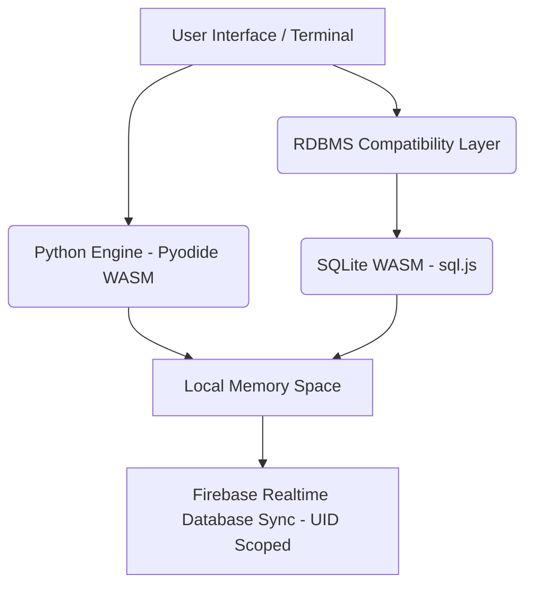

# Pulxo IDE: Browser-Based Python Compiler & RDBMS Sandbox

Welcome to **Pulxo IDE**, a state-of-the-art, high-performance browser-based IDE custom-designed for 12th CBSE Computer Science & Competitive Programming. It runs complex Python executions and full-featured SQL Database Management directly in the user's browser using WebAssembly (WASM), with real-time cloud persistence scoped per user.

---

## 🚀 Key Highlights & Architecture

Students and instructors can pull this repository and import all logic immediately. There is **zero server-side setup required** because the computational engines run completely client-side.



### 1. Pyodide WASM-Based Python Compiler (`src/lib/pythonEngine.js`)
Rather than relying on resource-intensive backend execution environments, Pulxo IDE uses **Pyodide** to run complete Python code runtimes client-side:
- **I/O Redirection**: Standard output (`stdout`) and standard error (`stderr`) streams are intercepted and dynamically piped into the terminal UI.
- **Interactive Prompt Queuing (`builtins.input`)**: Native Python synchronous `input()` prompts usually crash browser-based WASM runtimes. Pulxo IDE uses an intelligent injection system that overrides `builtins.input` to handle queued interactive standard input (`stdin`) gracefully without blocking the UI main thread.
- **Zero Latency**: Executes heavy algorithms in milliseconds.

### 2. SQL WASM & MySQL Emulator (`src/lib/sqlEngine.js`)
While standard client-side SQL uses raw SQLite, standard CBSE curricula focus on **MySQL/RDBMS**. Pulxo IDE bridges this gap by transpiling and emulating MySQL commands on top of SQLite WASM:
- **MySQL Compatibility Layer**: Intercepts and executes custom database-level commands:
  - `CREATE DATABASE db_name;` (Maintains isolated logical DB environments)
  - `USE db_name;` (Switches standard active execution contexts)
  - `SHOW DATABASES;` and `SHOW TABLES;`
  - `DESCRIBE table_name;` (Maps SQLite schema tables to standard MySQL layouts)
- **Logical Sandbox Isolation**: Tables created inside one database are entirely hidden when using another database.

### 3. Firebase UID-Scoped Real-time Persistence
- **Binary State Serialization**: Multi-DB SQLite instances are serialized into Base64 binaries using `exportAll()` and deserialized via `importAll()`.
- **User-Isolated Synchronization**: Saved state is pushed and pulled in real-time under `users/${user.uid}/sql_state_v2` in Firebase Realtime Database. Your workspaces and database schemas will dynamically follow you on any device as long as you log in!

### 🔒 Firebase Realtime Database Security Rules (`database.rules.json`)
To guarantee that no user can view or overwrite another student's compiler state or database schemas, the project requires the following secure architecture rules:
```json
{
  "rules": {
    "users": {
      "$uid": {
        ".read": "$uid === auth.uid",
        ".write": "$uid === auth.uid"
      }
    }
  }
}
```
**Why this is safe & high-performing:**
- **Scoped Read/Write Permissions**: The `$uid` variable matches the dynamic user directory node. By checking `"$uid === auth.uid"`, the database verifies that the authenticated user's ID matches the workspace's owner ID exactly.
- **Privacy & Prevention of Data Leakage**: Unauthenticated requests are rejected immediately, and logged-in students can only query, edit, or delete their own custom databases.

---

## 🛠️ Quickstart Guide for Students & Instructors

Import all logic perfectly into your local workspace with these 3 steps:

### 1. Clone & Install Dependencies
Ensure you have Node.js installed, then clone and run:
```bash
# Clone the repository
git clone https://github.com/GRISHM7890/pulxo-python.git
cd pulxo-python

# Install dependencies
npm install
```

### 2. Configure Firebase Environments
Create a `.env` file in the root directory to plug in your persistent Firebase instance:
```env
VITE_FIREBASE_API_KEY=your_api_key
VITE_FIREBASE_AUTH_DOMAIN=your_auth_domain
VITE_FIREBASE_DATABASE_URL=your_database_url
VITE_FIREBASE_PROJECT_ID=your_project_id
VITE_FIREBASE_STORAGE_BUCKET=your_storage_bucket
VITE_FIREBASE_MESSAGING_SENDER_ID=your_messaging_sender_id
VITE_FIREBASE_APP_ID=your_app_id
```

### 3. Run Locally
Spin up the fast Vite development server:
```bash
npm run dev
```
Open `http://localhost:5173` to interact with your fully persistent Python compiler and SQL terminal!

---

## 📂 Core Logical Modules

Students focusing on compiler/engine building should study these key files:
- **Python Execution Engine**: [`src/lib/pythonEngine.js`](file:///Users/grishmmahorkar/Desktop/PulxoPython/src/lib/pythonEngine.js)
- **MySQL Compatibility & SQLite WASM**: [`src/lib/sqlEngine.js`](file:///Users/grishmmahorkar/Desktop/PulxoPython/src/lib/sqlEngine.js)
- **Interactive Terminal Shell UI**: [`src/components/SqlWorkbench.jsx`](file:///Users/grishmmahorkar/Desktop/PulxoPython/src/components/SqlWorkbench.jsx)

Happy Coding & Querying! 🚀
